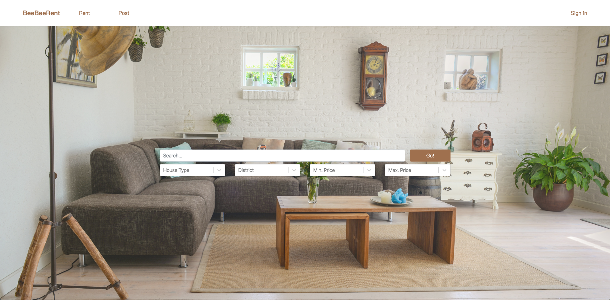
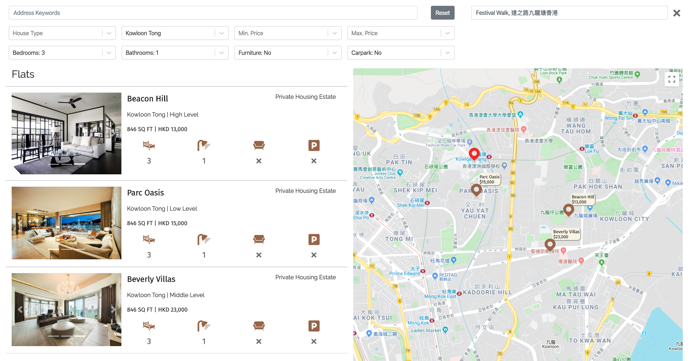
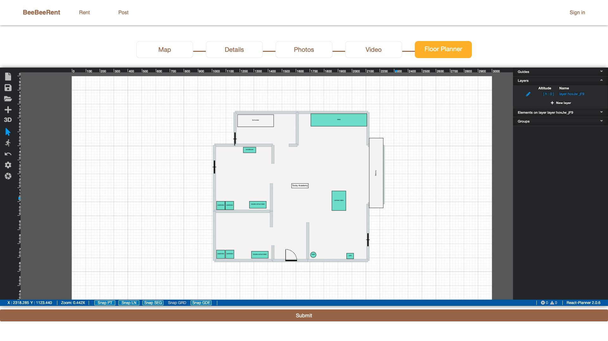
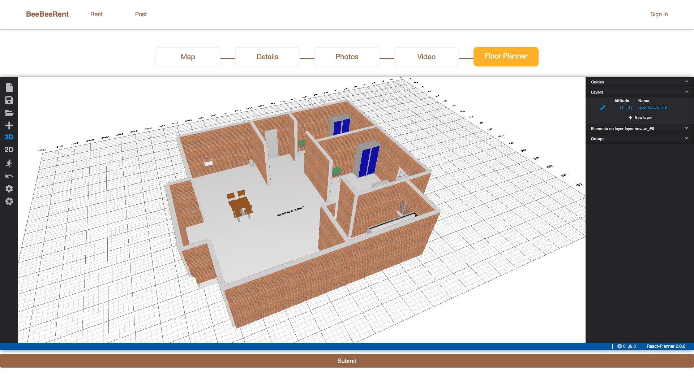
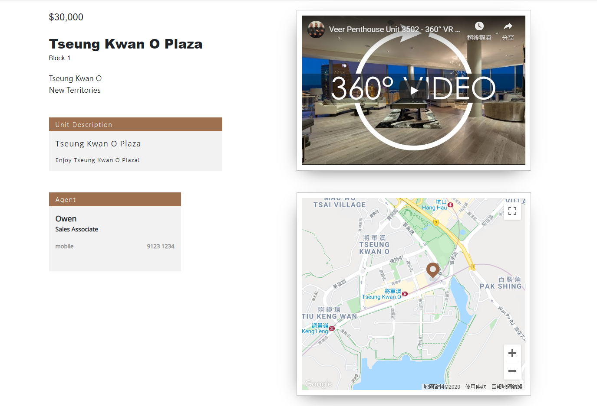
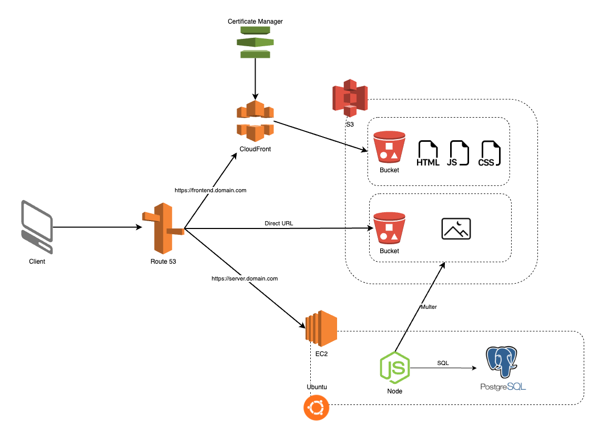

# BeeBeeRentals

## Description
BeeBeeRentals is a group project developed with two other developers. We developed this project from scratch as our final project for the Tecky Academy MicroMaster in A.I. & Programming Bootcamp.

The project was developed over a period of 2 weeks. It is a full-stack application designed to streamline the process of apartment rentals for landlords and tenants. 

The purpose of the application is to provide a user-friendly platform where landlords can easily list their apartments for rent, and potential tenants can find their ideal rental property quickly and efficiently.

Target Audience:

The application aims to simplify the rental process for both landlords and tenants by offering a seamless, informative, and visually engaging experience.

## Features
1. Interactive Front Page - The application's front page showcases a curated list of available apartments.

2. Location Visualization - Inspired by platforms like Airbnb, BeeBeeRentals integrates an interactive map feature.

3. Detailed Apartment Pages - Upon selecting a specific apartment, users are presented with a dedicated page containing comprehensive details.

4. 2D/3D Floor Plans - To enhance the visualization experience, BeeBeeRentals offers 2D and 3D floor plans for each apartment.

## Screenshots

*Developed searching API and landing page layout*

*Integrated the searching result with Google Map API*

*Integrated with react-planner to support 2D Floor Plan*

*Integrated with react-planner to support 3D Floor Plan*

*Developed login feature with supporting OAuth login*

*Embedded video player and Google Map in apartment's detail page*

## Architecture

*The frontend static files are deployed to S3, while the backend server is deployed to EC2.*

## Technologies Used

BeeBeeRentals incorporates a range of technologies, frameworks, and tools to deliver its robust functionality and optimal performance. The key technologies that played a significant role in the project include:

Frontend:
- ReactJS (with Typescript)
- SCSS

Backend:
- NodeJS (with Typescript)
- Express.js
- Knex.js

Database:
- PostgreSQL

Infrastructure: 
- AWS (Amazon Web Services)
- S3 (Simple Storage Service)
- EC2 (Elastic Compute Cloud)
- Route53
- CloudFront

## Challenges and Solutions

1. **Challenge**: The biggest challenge was to integrate the Google Map API into the application. The application needed to support the following functionalities:
    - Allow users to view the location of each apartment on the map
    - Allow the location of the apartment is recorded in the database when the user creates a new apartment listing

    **Solution**: We decided to use the Google Map API for React to support the functionalities mentioned above. We used the Google Map API to convert the address of the apartment into latitude and longitude, which is then stored in the database, so that we can display the location of apartment on the map.

2. **Challenge**: The next challenge was to integrate the 2D/3D floor plan feature into the application. The application needed to support the following functionalities:
    - Allow users to upload floor plan images
    - Allow users to draw walls on the floor plan images
    - Allow users to add doors and windows to the floor plan images
    - Allow users to view the floor plan in 3D
    - Allow users to save the floor plan

    **Solution**: We decided to use react-planner to support the 2D/3D floor plan feature. We used the react-planner API to support the functionalities mentioned above.

## Future Enhancements
### 1. Performance Optimization
- Use Redis to cache the frequently accessed data e.g. apartments' data
- Create index in the database to improve the performance of the database query
- Use Read Replica to improve the performance of the database

### 2. Reliability
- Use load balancer to distribute the traffic to different servers
- Use multiple availability zones to ensure the application is still available when one availability zone is down
- Data replication and backup to ensure the data is not lost when the server is down
- Use auto scaling to scale up or down the number of servers based on the traffic

### 3. Cost Optimization
- Edit S3 lifecycle policy to move the static files to Glacier after a period of time
- May use reserved instance to reduce the cost of EC2